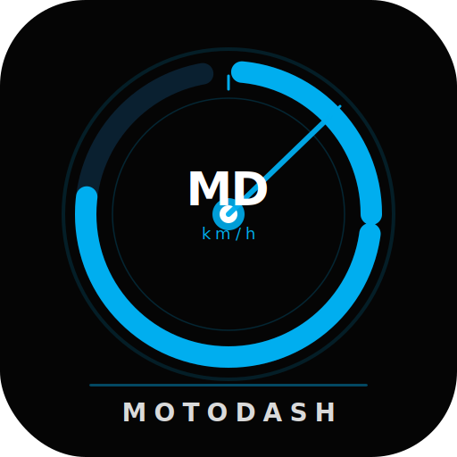

# 🏍 MotoDash — Premium Motorcycle Dashboard PWA

> Futuristic TFT-style motorcycle dashboard running entirely in the browser.  
> GPS Speedometer · Navigation Maps · Turn-by-Turn · Voice Assistant · Bluetooth · Media Control



---

## 🗂 Project Structure

```
motodash/
├── index.html              # Main dashboard UI
├── manifest.json           # PWA manifest (installable)
├── sw.js                   # Service Worker (offline cache, TTL rules)
├── generate-icons.html     # Helper: generate PNG icons from SVG
├── .nojekyll               # Required for GitHub Pages
│
├── css/
│   ├── style.css           # Complete premium dark theme
│   └── fonts.css           # Self-hosted @font-face declarations
│
├── js/
│   ├── utilities.js        # Haversine, EventBus, Storage, formatters, GPX
│   ├── trip.js             # Trip computer: distance, avg/max speed, duration
│   ├── speedometer.js      # GPS watchPosition, Kalman filter, arc gauge, compass
│   ├── maps.js             # Leaflet.js, OSM tiles, Nominatim, OSRM routing
│   ├── bluetooth.js        # Web Bluetooth API, device list, battery level
│   ├── voice.js            # Web Speech API, command parsing, TTS
│   ├── media.js            # Internal HTML5 audio player + Media Session API
│   └── app.js              # Main controller: panels, clock, settings, PWA
│
├── vendor/                 # Self-hosted third-party libraries (NOT CDN)
│   ├── leaflet/                     # Leaflet 1.9.4 (map engine)
│   ├── leaflet-routing-machine/     # Routing Machine 3.2.12 (turn-by-turn)
│   ├── jsmediatags/                 # ID3 tag reader for music player
│   └── fonts/                       # Orbitron, Rajdhani, Share Tech Mono (woff2)
│
└── assets/
    └── icons/
        ├── icon.svg        # Vector app icon
        ├── icon-192.png    # (generate with generate-icons.html)
        └── icon-512.png    # (generate with generate-icons.html)
```

> ⚠️ The `vendor/` folder **must** be uploaded to GitHub along with everything
> else — it is part of the application, not a build artifact. Without it,
> the map and music features will not work.

---

## 🔒 Security & Privacy

This app is hardened to minimize third-party trust and give you explicit
control over every domain it talks to.

### Self-hosted, zero CDN dependency
Every static library (Leaflet, Leaflet Routing Machine, jsmediatags, and
all fonts) is vendored under `vendor/` and `css/fonts.css`, served from
**your own domain** (GitHub Pages). Nothing is loaded from `unpkg.com`,
`cdnjs.cloudflare.com`, or `fonts.googleapis.com`. This removes an entire
class of bugs (e.g. a CDN going down, or a corrupted integrity hash
silently blocking a script) and removes every third party that could
otherwise see your visitors' IP address on every page load.

### Explicit destination allow-list (Content-Security-Policy)
`index.html` declares a strict CSP that blocks **any** domain not on the
list below. Only 3 domains are reachable, and only because they are live
data services that cannot be self-hosted as static files:

| Domain | Why it's needed | Can it be self-hosted? |
|---|---|---|
| `nominatim.openstreetmap.org` | Address/place search results | ❌ Live geocoding service |
| `router.project-osrm.org` | Turn-by-turn route calculation | ❌ Live routing service |
| `*.basemaps.cartocdn.com` | Map tile images | ❌ Live tile rendering service |

Every other resource — scripts, styles, fonts — is restricted to `'self'`
(your own domain only) via `script-src 'self'`, `font-src 'self'`, etc.

### Cache rules with explicit expiry (TTL)
`sw.js` no longer caches anything indefinitely. Each cache type has its
own rule:

| Cache | Strategy | TTL |
|---|---|---|
| App shell (HTML/CSS/JS, vendor libs, fonts) | Stale-While-Revalidate | versioned via `CACHE_VERSION` |
| Map tiles | Cache-First | 7 days |
| Nominatim search results | Network-First | 1 hour |
| OSRM routes | Network-Only | never cached |

Bump `CACHE_VERSION` in `sw.js` on any deploy that changes cached files —
old caches are purged automatically on activate.

### Cookie policy
This app **never sets a cookie**. All local state (trip data, GPS
calibration, riding mode, settings) lives exclusively in `localStorage`,
which never leaves the browser and is never sent over the network. Since
every script/style/font is self-hosted, no third party has any
opportunity to set a cookie on this page either.

### (Optional) Use your own custom domain
GitHub Pages lets you front the site with a domain you own and control,
instead of `username.github.io`:

1. Add a `CNAME` file at the repo root containing just your domain, e.g.:
   ```
   motodash.yourdomain.com
   ```
2. At your DNS provider, add a `CNAME` record pointing
   `motodash.yourdomain.com` → `username.github.io`
3. GitHub repo → Settings → Pages → **Custom domain** → enter the same
   domain → **Enforce HTTPS** ✅

This gives you full control over the domain itself (DNS, certificate
monitoring, CAA records) on top of the app-level controls above.

---

## 🚀 Technologies Used

| Stack | Library / API | Notes |
|-------|--------------|-------|
| Maps | **Leaflet.js** + OpenStreetMap | Free, no API key |
| Tiles | **CartoDB Dark Matter** | Free, no API key |
| Routing | **Leaflet Routing Machine** + OSRM | Free public server |
| Geocoding | **Nominatim** (OpenStreetMap) | Free, rate-limited |
| GPS | **Geolocation API** | Browser native |
| Bluetooth | **Web Bluetooth API** | Chrome/Edge Android |
| Voice | **Web Speech API** | Chrome/Edge |
| Compass | **DeviceOrientation API** | Browser native |
| Media | **Media Session API** | Browser native |
| Offline | **Service Worker** + Cache API | PWA standard |
| Wake Lock | **Wake Lock API** | Prevents screen sleep |
| Storage | **LocalStorage** + IndexedDB | Persist trip data |

---

## ⚡ Cara Menjalankan Lokal (Run Locally)

### Option A — Python HTTP Server
```bash
cd motodash
python3 -m http.server 8080
# Open: http://localhost:8080
```

### Option B — Node.js
```bash
npx serve motodash
# Open: http://localhost:3000
```

### Option C — VS Code Live Server
Install the **Live Server** extension, right-click `index.html` → *Open with Live Server*.

> ⚠️ **Must use a local server** — GPS, Bluetooth, and Service Worker require HTTPS or localhost.  
> Opening `index.html` directly as `file://` will not work.

---

## 🌐 Deploy ke GitHub Pages

### Step 1 — Create Repository
```bash
git init
git remote add origin https://github.com/YOUR_USERNAME/motodash.git
```

### Step 2 — Push Code
```bash
git add .
git commit -m "feat: MotoDash v1.0.0 initial release"
git push -u origin main
```

### Step 3 — Enable GitHub Pages
1. Go to **Repository → Settings → Pages**
2. Source: **Deploy from branch**
3. Branch: **main**, Folder: **/ (root)**
4. Save — wait ~60 seconds
5. Access at: `https://YOUR_USERNAME.github.io/motodash/`

---

## 📱 Cara Install PWA di Android

1. Buka Chrome Android → navigasi ke URL GitHub Pages
2. Tunggu aplikasi dimuat sepenuhnya
3. Tap menu **⋮ (3 titik)** → **"Add to Home Screen"**
4. Konfirmasi nama "MotoDash" → **Add**
5. Icon MotoDash akan muncul di home screen
6. Aplikasi akan berjalan **fullscreen landscape** tanpa browser UI

### Generate PNG Icons (Required for Install)
Sebelum deploy, generate icon PNG:
1. Buka `generate-icons.html` di browser (harus dari server, bukan `file://`)
2. Klik **Generate PNG Icons**
3. Download `icon-192.png` dan `icon-512.png`
4. Simpan di folder `assets/icons/`
5. Deploy ulang ke GitHub Pages

---

## 🛰 Cara Kerja GPS Speedometer

### Kalman Filter
```
GPS memberi kecepatan raw (m/s) → convert ke km/h
       ↓
Kalman Filter smoothing (P, Q, R parameters)
       ↓
Target speed (smooth, no jumps)
       ↓
Animation loop: displaySpeed += diff × easing_factor
       ↓
SVG arc stroke-dashoffset animated at 60 FPS
```

### Haversine Fallback
Jika GPS tidak memberikan native speed:
```
distance = haversine(lastLat,lastLng, currentLat,currentLng)
time_delta = currentTimestamp - lastTimestamp
speed_kmh = (distance / time_delta) * 3600
```

### Kalman Filter Tuning
Filter menggunakan parameter tetap yang sudah diseimbangkan (`Q=0.0001, R=0.01`)
— cukup halus untuk mengurangi noise GPS, namun tetap responsif terhadap
perubahan kecepatan nyata. Tidak ada mode berkendara (ECO/NORMAL/SPORT)
karena dashboard ini **tidak terhubung ke mesin/ECU motor** — hanya
membaca GPS, sehingga "riding mode" semacam itu hanya kosmetik dan
berpotensi menyesatkan pengguna.

---

## 🗺 Cara Kerja Maps Navigation

1. **GPS fix** → EventBus emits `gps:update` → Maps moves motorcycle marker
2. **Search** → Nominatim API `nominatim.openstreetmap.org/search`
3. **Select destination** → Leaflet Routing Machine creates OSRM route
4. **OSRM** calls `router.project-osrm.org/route/v1/driving/lng1,lat1;lng2,lat2`
5. Route rendered as blue line on map
6. Turn instructions displayed in navigation bar
7. Each GPS fix checks distance to next waypoint (< 25m = advance step)
8. Voice announces each turn instruction

---

## 🎤 Voice Commands

| Command | Action |
|---------|--------|
| `Navigate to [tempat]` | Cari dan mulai navigasi |
| `Open maps` | Buka panel Maps |
| `Current location` | Centre map ke posisi sekarang |
| `Show speed` | Ucapkan kecepatan saat ini |
| `Zoom in / Zoom out` | Zoom peta |
| `Stop navigation` | Hentikan navigasi |
| `Open settings` | Buka Settings |
| `Open Bluetooth` | Buka panel Bluetooth |
| `Play / Pause music` | Kontrol media |
| `Next / Previous track` | Ganti lagu |

### Mengaktifkan Voice Assistant
1. Buka panel **VOICE** dari dock
2. Tap **🎤 START LISTENING**
3. Ucapkan perintah dalam bahasa yang dipilih
4. Text hasil recognition tampil di kotak "RECOGNIZED"

---

## 📡 Pairing Bluetooth

1. Pastikan menggunakan **Chrome atau Edge** di Android
2. Pastikan URL adalah **HTTPS** (GitHub Pages sudah HTTPS)
3. Buka panel **BT** dari dock
4. Tap **SCAN DEVICES**
5. Browser akan memunculkan dialog Bluetooth device picker
6. Pilih headset/perangkat yang ingin di-pair
7. Konfirmasi pairing di perangkat
8. Status akan berubah menjadi **● CONNECTED**
9. Jika perangkat memiliki Battery Service, level baterai akan tampil

---

## 🎨 Color Theme &amp; Day/Night Mode

MotoDash mendukung 3 tema warna dan mode tampilan siang/malam, keduanya
bisa dikombinasikan bebas (misal: tema Purple + Day Mode sekaligus).

### Color Theme
**Settings → DISPLAY → Color Theme** — pilih salah satu:
| Tema | Warna Utama | Karakter |
|---|---|---|
| **CYBER** (default) | Cyan + Hijau | Futuristik, klasik MotoDash |
| **INFERNO** | Oranye + Amber | Agresif, sporty |
| **PURPLE** | Ungu + Cyan | Premium, mewah |

Pilihan tersimpan otomatis dan tetap aktif setiap kali aplikasi dibuka.

### Day / Night Mode
**Settings → DISPLAY → Auto Day/Night**:
- **ON** (default): otomatis beralih — Day mode jam 06:00–19:00, Night mode di luar itu
- **OFF**: kontrol manual via tombol **☀ DAY** / **🌙 NIGHT** di bawahnya

Klik tombol DAY/NIGHT manual akan otomatis menonaktifkan Auto. Catatan:
peta tetap menggunakan tema gelap (CartoDB Dark) di kedua mode — hanya
UI di sekitarnya (panel kiri, toolbar, dock) yang berubah terang/gelap.

---

## ⚙️ GPS Calibration

Digunakan jika posisi GPS tidak akurat atau ada offset sistematis:

1. Buka **Settings → GPS CALIBRATION**
2. Masukkan **Latitude Offset** (positif = utara, negatif = selatan)
3. Masukkan **Longitude Offset** (positif = timur, negatif = barat)
4. Tap **Save** → disimpan ke LocalStorage
5. Tap **Reset** untuk kembali ke 0,0

Contoh: jika GPS selalu 10 meter ke selatan, masukkan lat offset +0.0001

---

## 📊 Trip Meter

Tampil langsung di panel kiri (di bawah kompas), data yang dicatat:
- **TRIP**: Total jarak perjalanan (km)
- **AVG**: Rata-rata kecepatan saat bergerak (> 3 km/h)
- **MAX**: Kecepatan tertinggi tercatat
- **TIME**: Durasi perjalanan (jam:menit:detik)

Data otomatis disimpan ke LocalStorage setiap 30 detik.

### Reset Trip
Tombol **↺ RESET** tersedia langsung di header widget Trip Meter (panel
kiri) — tidak perlu masuk ke Settings. Klik tombol tersebut, konfirmasi
dialog akan muncul untuk mencegah penghapusan data tidak sengaja.
Tombol Reset Trip yang sama juga masih tersedia di **Settings → TRIP
COMPUTER** sebagai akses alternatif.

### Export GPX
1. **Settings → TRIP COMPUTER → Export GPX**
2. File GPX didownload ke perangkat
3. Dapat dibuka di Google Maps, Komoot, Garmin Connect, dll

---

## 🏗 Cara Menambahkan Fitur Baru

### Tambah Panel Baru
1. Tambah `<div id="panel-namafitur" class="content-panel">` di `index.html`
2. Tambah dock button dengan `data-panel="namafitur"`
3. Style di `css/style.css`
4. Logic di `js/namafitur.js`
5. Include script di `index.html`

### Tambah Voice Command Baru
Di `js/voice.js`, tambahkan objek ke array `_commands`:
```javascript
{
  patterns: [/perintah baru (.+)/],
  fn: (match) => {
    // aksi
    this.speak('Respons suara');
  }
}
```

### Tambah GPS Event Listener
```javascript
Utils.EventBus.on('gps:update', ({ lat, lng, speed, heading }) => {
  // gunakan data GPS di sini
});
```

### Tambah Setting Baru
1. Tambah UI di panel Settings di `index.html`
2. Bind event di `app.js` dalam `_setupSettingsUI()`
3. Simpan ke `Utils.Storage.set('key', value)`

---

## 🔧 Offline Mode

Service Worker menggunakan strategi berbeda per request:

| Request Type | Strategy | Cache |
|-------------|----------|-------|
| App shell (HTML/CSS/JS) | Stale-While-Revalidate | SHELL |
| CDN (Leaflet, Fonts) | Cache-First | CDN |
| Map tiles (CartoDB/OSM) | Cache-First | TILES |
| Nominatim search | Network-First | API |
| OSRM routing | Network-Only | — |

Map tiles ter-cache otomatis saat user scroll/zoom. Area yang sudah pernah dilihat akan tersedia offline.

---

## 🎨 Kustomisasi Tema

Edit variabel CSS di `css/style.css`:

```css
:root {
  --clr-primary   : #00AEEF;  /* Cyan utama */
  --clr-secondary : #00FF66;  /* Hijau aksen */
  --clr-warning   : #FFAA00;  /* Warning orange */
  --clr-danger    : #FF4444;  /* Danger red */
  --bg-primary    : #050505;  /* Background hitam */
}
```

---

## 📋 Browser Support

| Browser | GPS | Maps | Voice | Bluetooth | Wake Lock |
|---------|-----|------|-------|-----------|-----------|
| Chrome Android | ✅ | ✅ | ✅ | ✅ | ✅ |
| Edge Android | ✅ | ✅ | ✅ | ✅ | ✅ |
| Firefox Android | ✅ | ✅ | ❌ | ❌ | ✅ |
| Safari iOS | ✅ | ✅ | ⚠️ | ❌ | ❌ |
| Chrome Desktop | ✅ | ✅ | ✅ | ✅ | ✅ |

**Recommended**: Chrome Android untuk pengalaman terbaik.

---

## ⚖️ Lisensi & Kredit

- **Maps**: © OpenStreetMap contributors (ODbL)
- **Tiles**: © CartoDB (CC BY 3.0)
- **Routing**: OSRM (2-clause BSD)
- **Leaflet.js**: © Vladimir Agafonkin (BSD)
- **MotoDash App**: MIT License

---

## 📞 Troubleshooting

**GPS tidak muncul:**
- Pastikan browser mendapat izin lokasi
- Coba di luar ruangan untuk sinyal lebih kuat
- GPS Accuracy "POOR" = kurang sinyal satelit

**Bluetooth tidak bisa scan:**
- Harus menggunakan HTTPS (bukan http://)
- Chrome/Edge Android saja yang support Web Bluetooth
- Enable Bluetooth di perangkat terlebih dahulu

**Voice tidak merespon:**
- Pastikan mikrofon sudah diberi izin
- Chrome/Edge saja yang support Web Speech API
- Pastikan tidak ada tab lain yang menggunakan mikrofon

**Map tidak muncul:**
- Periksa koneksi internet (pertama kali butuh internet)
- Coba refresh halaman
- Clear cache jika ada masalah

**PWA tidak bisa diinstall:**
- Harus dari HTTPS (GitHub Pages ✅)
- Harus ada icon PNG 192×192 dan 512×512
- Generate icons dulu via `generate-icons.html`
